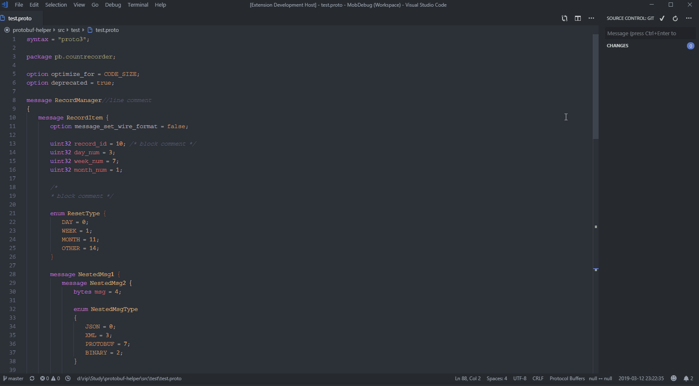

# README

Sometimes you don't really care about the Protobuf filed ID, but things keep getting worse when there are more and more fileds. To save time, this extension helps you reset filed ID with auto-increment number starting from 1(for message)/0(for enum).

# How to Use

Open proto file and goto command palette by pressing (`Ctrl+Shift+P` or `Cmd+Shift+P` on Mac), then run `Reset Field ID`.

## TODO

Works with ID reserved / alias.

## Extension Settings

None.
